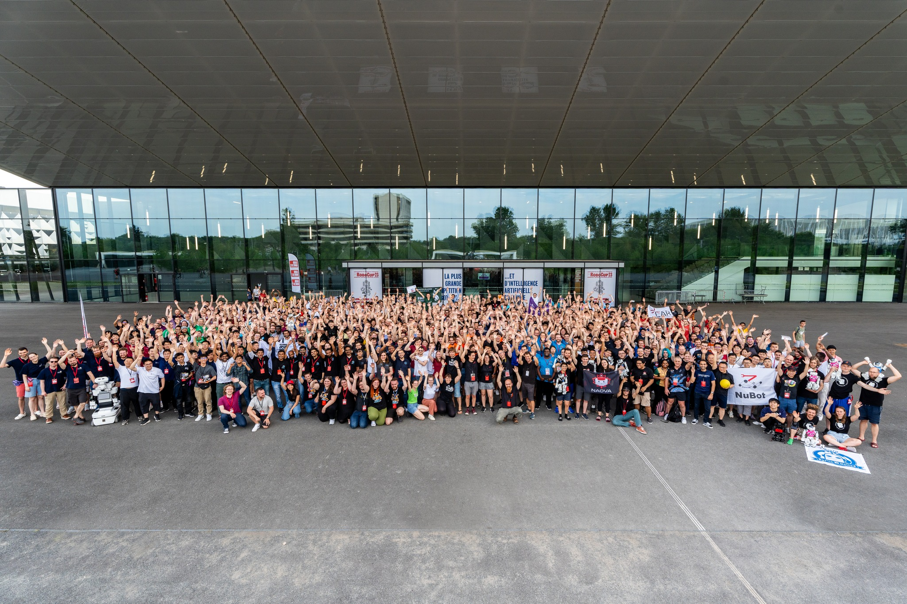
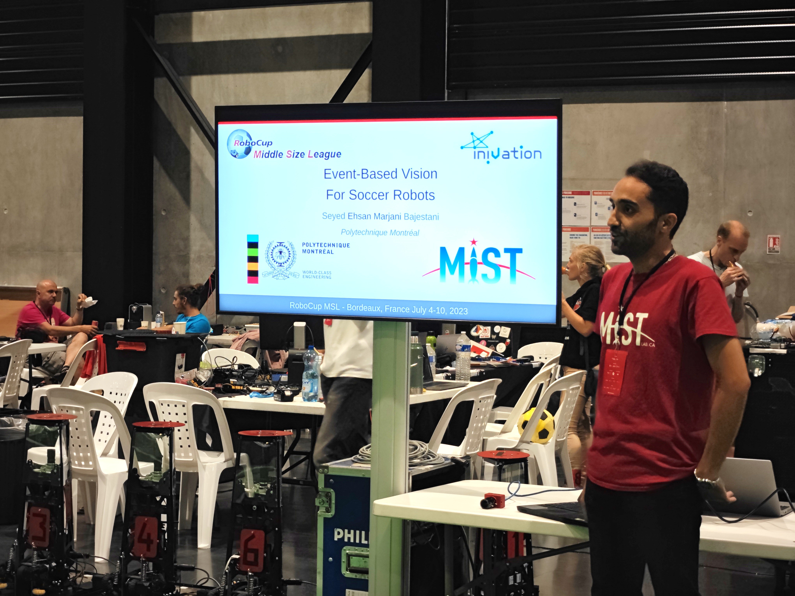
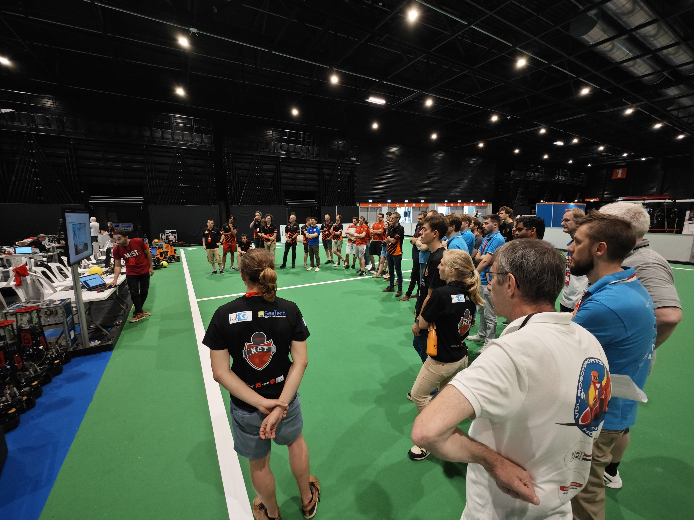
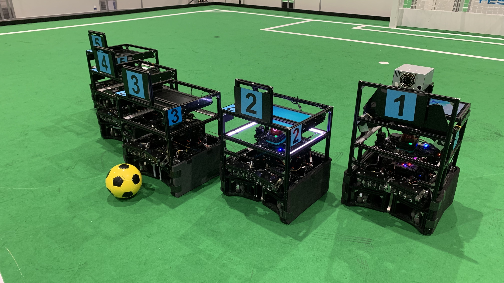
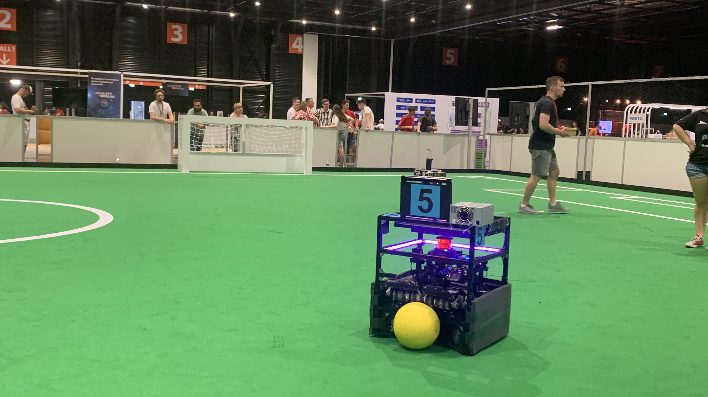
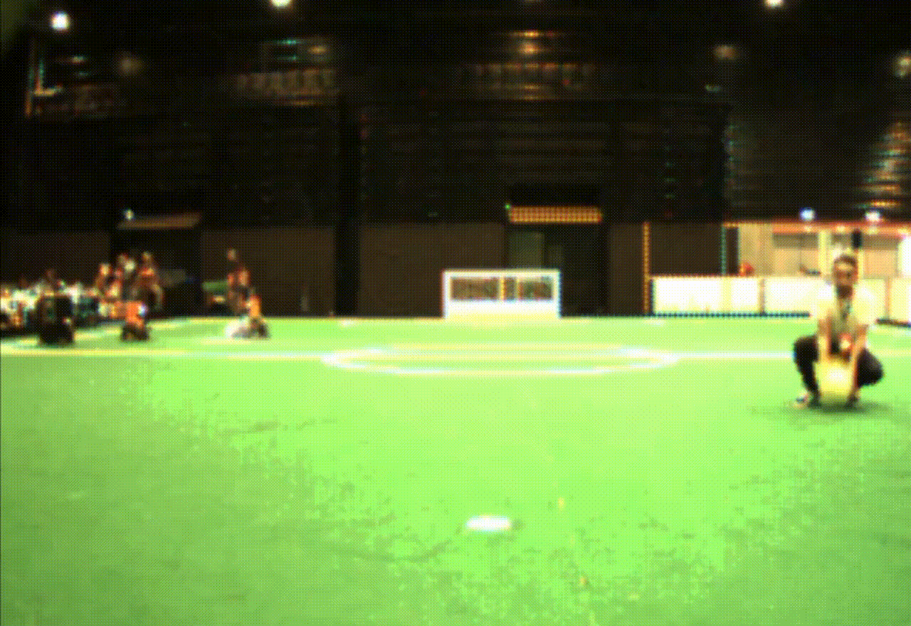
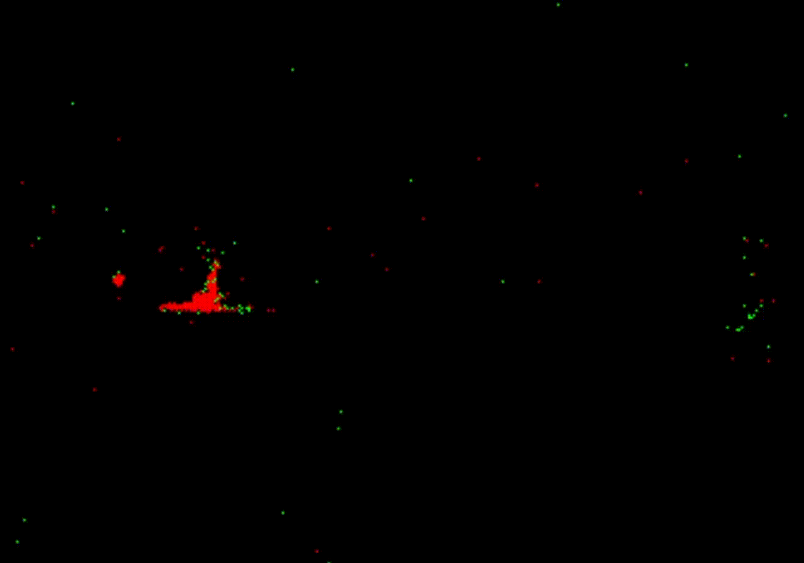
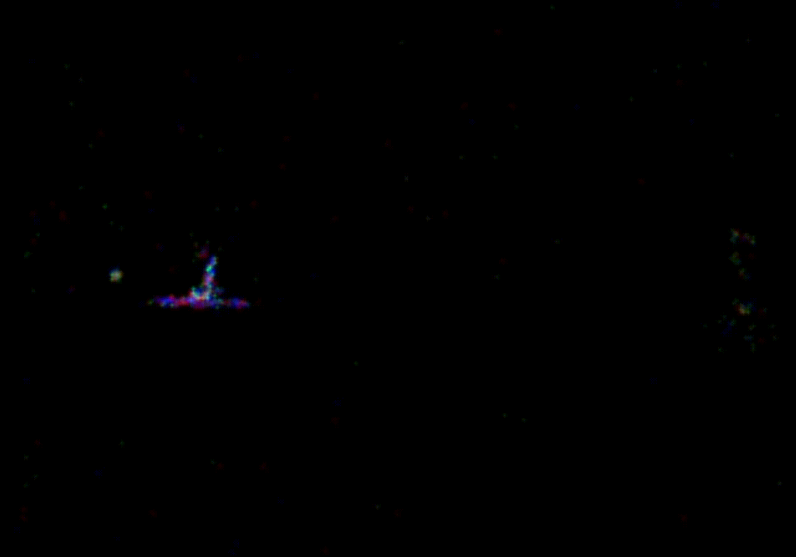

# Collected events with event-based cameras.

This repository contains recorded events with event-based cameras.

## RoboCup 2023

The 26th edition of the [RoboCup](https://www.robocup.org/) was held from July 4 to 10, 2023 in [Bordeaux, France](https://www.u-bordeaux.fr/universite/notre-strategie/projets-institutionnels/intelligence-artificielle/robocup-2023).
The event saw an impressive turnout of over 15,000 participants, comprising 2,500 competitive individuals representing 45 different countries worldwide.

We extend our appreciation to the [iniVation company](https://inivation.com/) for the provision of a [DAVIS346 color](https://inivation.com/buy/) event-based camera,
which facilitated our presentation of this camera to members of the RoboCup community participating in the soccer robot league [(Middle Size League)](https://msl.robocup.org/).
Teams are eagerly anticipating the utilization of event-based cameras on their robots (particularly on their goalkeeper robot).

The French team [Robot Club Toulon](https://rct.univ-tln.fr/) has collaborated to affix the camera onto their robot during intermissions between matches, aiming to record some events.

The following videos clearly show the MSL ball can be detected without blurring by using the event-based camera compared to frame-based ones.
To visualize the recorded event files (aedat4), [DV software](https://inivation.gitlab.io/dv/dv-docs/docs/getting-started.html) is needed.
DV is the software for the iniVation Dynamic Vision Sensors (DVS/DAVIS).

The following videos show the ball_approaching_air_01.aedat4 frames, events, and accumulated color events at **normal speed**

The following videos show the ball_approaching_air_01.aedat4 frames, events, and accumulated color events at **1/20x speed**

